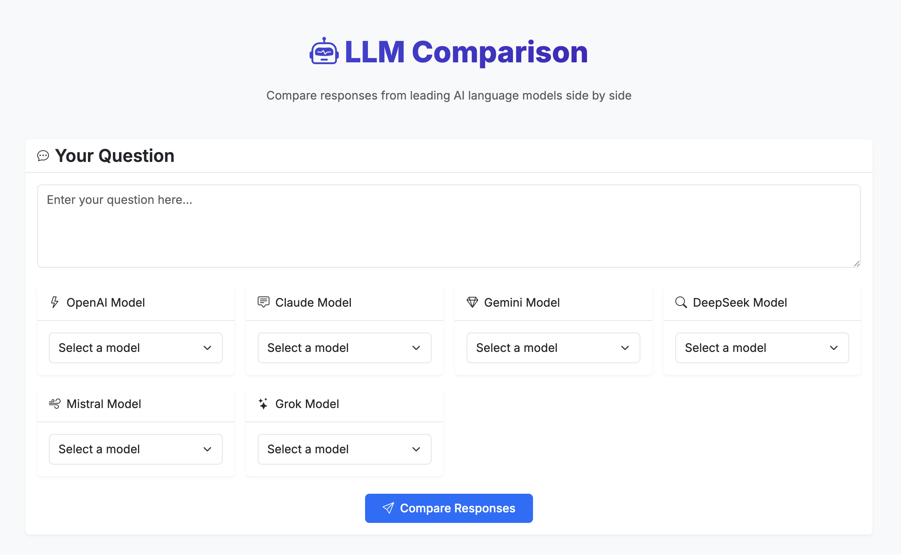

# LLMs Comparison Tool



A web application that allows you to compare responses from different Large Language Models (LLMs) side by side. I created this tool because I was tired of switching between different platforms to compare responses from various AI models.

## Features

- Compare responses from multiple LLM providers:
  - OpenAI (GPT models)
  - Anthropic (Claude models)
  - Google (Gemini models)
  - DeepSeek
  - Mistral
  - Grok
- Dynamic model availability based on your API credentials
- Real-time response comparison
- Response time tracking
- Modern and responsive UI
- Easy-to-use interface
- Export responses to PDF with a single click

## Prerequisites

- Python 3.8 or higher
- API keys for the LLM providers you want to use
- Modern web browser with JavaScript enabled

## Installation

1. Clone the repository:
```bash
git clone https://github.com/yourusername/llms-comparison.git
cd llms-comparison
```

2. Create a virtual environment and activate it:
```bash
python -m venv venv
source venv/bin/activate  # On Windows, use: venv\Scripts\activate
```

3. Install the required packages:
```bash
pip install -r requirements.txt
```

4. Create a `.env` file in the root directory with your API keys (you can copy from `.env.example`):
```env
# LLM API Keys
OPENAI_API_KEY=your_openai_api_key_here
ANTHROPIC_API_KEY=your_anthropic_api_key_here
GOOGLE_API_KEY=your_google_api_key_here
DEEPSEEK_API_KEY=your_deepseek_api_key_here
MISTRAL_API_KEY=your_mistral_api_key_here
GROK_API_KEY=your_grok_api_key_here

# Flask application settings
FLASK_APP=app.py
FLASK_ENV=development
SECRET_KEY=generate_a_secure_random_key
```

## Usage

1. Start the Flask application:
```bash
python app.py
```

2. Open your web browser and navigate to `http://localhost:5000`

3. Select the models you want to compare from the available options. Note that:
   - Only models that you have access to with your API credentials will be shown
   - Model availability is checked in real-time
   - If a model becomes unavailable, you'll receive an error message

4. Enter your query in the text area and click "Compare"

5. View the responses from each model side by side, including:
   - The response text
   - The model used
   - Response time

6. Download the comparison results as a PDF by clicking the "Download PDF" button at the top of the responses section

## Port Configuration

By default, the application runs on port 5000. To use a different port, you can:

1. Modify the app.run() call in app.py:
```python
if __name__ == '__main__':
    app.run(debug=True, port=8000)  # Change 8000 to your desired port
```

2. Or set the PORT environment variable before running:
```bash
PORT=8000 python app.py
```

## Dependencies

The application relies on the following Python packages with specific versions:
- flask==2.3.3
- openai==1.3.0
- anthropic==0.8.0
- google-generativeai==0.3.0
- python-dotenv==1.0.0
- mistralai==0.0.9
- requests==2.31.0

Frontend dependencies (loaded via CDN):
- Bootstrap 5.3
- Marked.js (for Markdown rendering)
- jsPDF (for PDF generation)
- html2canvas (for PDF generation)

## API Endpoints

- `GET /api/models`: Returns a list of available models for each provider based on your API credentials
- `POST /api/query`: Sends a query to the selected models and returns their responses

## Error Handling

The application includes comprehensive error handling:
- Invalid or missing API keys
- Unavailable models
- API rate limits
- Network issues
- Invalid requests

## Future Improvements

Some ideas for future enhancements:
- Add support for more LLM providers
- Implement conversation history
- Add the ability to save and load queries
- Implement user authentication for saving preferences
- Add more customization options for model parameters

## Contributing

Contributions are welcome! Please feel free to submit a Pull Request. If you have any questions or suggestions, feel free to open an issue. See CONTRIBUTING.md for more details.

## License

This project is licensed under the MIT License - see the LICENSE file for details.

## Acknowledgments

- Thanks to all the LLM providers for their amazing APIs
- Inspired by the need to compare different AI models efficiently 